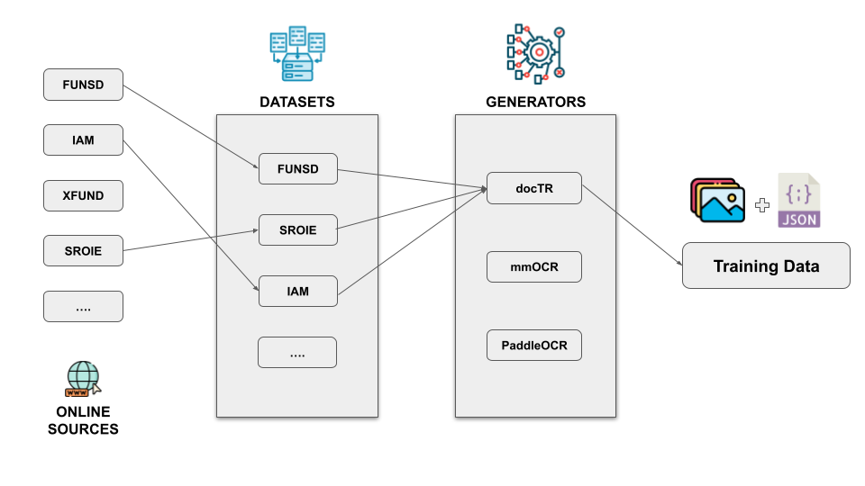

# OCR dataset generator
This project is a tool for downloading and managing `OCR` datasets, combining online and local sources. It supports the creation of training data for `text detection` and `text recognition` for various OCR tools. This project offers 2 types of operation and they are [data-generation](#training-data-generation-process) and [label-drawing](#bounding-box-drawing-process).



## Supported OCR tools
- `doctr`: https://github.com/mindee/doctr
- `easyocr`: https://github.com/JaidedAI/EasyOCR
- `mmocr`: https://github.com/open-mmlab/mmocr
- `paddleocr`: https://github.com/PaddlePaddle/PaddleOCR
- `yolo+trocr`: [YOLO](https://github.com/ultralytics/yolov5), [TrOCR](https://arxiv.org/abs/2109.10282)

## Available datasets
- `CORD`: https://paperswithcode.com/dataset/cord
- `FUNSD`: https://guillaumejaume.github.io/FUNSD/
- `GNHK`: https://www.goodnotes.com/gnhk
- `IAM`: https://fki.tic.heia-fr.ch/databases/iam-handwriting-database (Coming Soon)
- `SROIE`: https://paperswithcode.com/paper/icdar2019-competition-on-scanned-receipt-ocr
- `WILDRECEIPT`: https://paperswithcode.com/dataset/wildreceipt
- `XFUND`: https://github.com/doc-analysis/XFUND (`de`,`es`,`fr`,`it`,`ja`,`pt`,`zh`)

## Setup
```shell
# clone the repository
git clone https://github.com/xReniar/OCR-Dataset-Generator.git

# install the requirements:
cd OCR-Dataset-Generator
pip3 install -r requirements.txt
```
# How to use
Below are the instructions on how to properly use this project. Each process requires correct configuration of the `pipeline.yaml` file,
where you can specify key parameters such as the datasets to use, the character dictionary (dict), the tasks to perform, and more.
Interactive examples (dropdown menus) are provided to guide through the configuration, along with the commands needed to launch each process.

> [!NOTE]
> If the process does not start check [error-checking](#error-checking). 

## Bounding Box Drawing Process
This process draws bounding boxes on images using annotation files. The annotations are loaded from the `labels` folder of each dataset in `./data`. Before executing the drawing process, verify the following parameters in `./pipeline.yaml`:
- `datasets`: Selected dataset directories (relative to ./data) to process (to select a dataset set it to `y`). Dataset not present in the `./data` folder will be downloaded first.
- `draw-process`:
  - `color`: Bounding box color in BGR format (e.g., [255, 0, 0] for red).
  - `thickness`: Line width (in pixels).
- `dict`: Path to a `.txt` file containing allowed characters. It acts like a filter, if the text does not contain any of the characters specified in the `.txt` file then the associated bounding box will not be drawn. If this field is left empty then all the bounding box are drawn.
- `workers`: Number of parallel threads for processing (recommended 4, depends on the numbers of cores) 

> [!TIP]
> <details>
> <summary>Example</summary>
>
> Drawing labels of `CORD` dataset with black bounding boxes with thickness 2, using `en_dict.txt`:
>
> ```yaml
> draw-process:
>     color: [0, 0, 0]
>     thickness: 2
>
> dict: ./dict/en_dict.txt
> workers: 8
>
> # it's possible to draw bounding boxes for multiple datasets
> # just set to 'y' the dataset needed
> datasets:
>     cord: y
>     ....
> ```
> </details>

To start the drawing process run this command:
```bash
python main.py --draw
```
If the process terminates correctly a `cord` folder (the name depends on the selected dataset) will appear inside `./draw`.

## Training data Generation Process
This process generates training data for the specified [ocr-tool](#supported-ocr-tools), the annotations are loaded from the `labels` folder of each dataset selected. Before generating the training data verify the following parameters in `./pipeline.yaml`:
- `test-name`: Name identifier for this training data generation process
- `ocr-system`: The OCR system being used for training data generation, the possible choices are listed [here](#supported-ocr-tools)
- `augmentation`: Whether data augmentation is applied (True of False), check [data augmentation](#data-augmentation)
- `tasks`: Task for the training data, set to `y` the necessary tasks
- `dict`: Path to the dictionary file being used for the training data. It acts like a filter depending on the task (if left empty then all the bounding boxes and text will be included):
  - for the `detection` task the bounding box will not be included in the generated data
  - for the `recognition` task the text will not be included in the generated data
- `workers`: Number of parallel threads for processing (depends on the numbers of cores) 
- `datasets`: Selected dataset directories (relative to ./data) to use for the training-data generation (to select a dataset set it to `y`). Dataset not present in the `./data` folder will be downloaded first.

> [!TIP]
> <details>
> <summary>Example</summary>
>
> Generating training data with `CORD` and `SROIE` dataset for `paddleocr`. The data is for text detection and text recognition using `en_dict.txt` (No augmentation applied). The training data name is `example-test`:
>
> ```yaml
> test-name: example-test
> ocr-system: paddleocr
> augmentation: false
>
> tasks:
>     det: y
>     rec: y
>
> dict: ./dict/en_dict.txt
> workers: 8
>
> datasets:
>     cord: y
>     sroie: y
> ```
> </details>

To start the drawing process run this command:
```bash
python main.py --generate
```

If the process terminates correctly then an `output` folder will appear (read [here](#data-output) for instructions on how to use the training-data):
```
.
└── output
    └── example-test-paddleocr
        ├── Detection
        │   └── ....
        └── Recognition
            └── ....
```

# Error checking
Before generating the training data or drawing the labels there is an `error-checking` step, which basically checks for missing labels or missing images or wrong bounding box coordinates. If there are some errors a `./errors.json` file will be created with this structure:
```json
{
    "dataset-name" {
        "missing_images": [],
        "missing_labels": [],
        "label_checking": {
            "path/to/label.txt" {
                "line": 34, 
                "text": "text",
                "bbox": []
            }
        }
    }
}
```
- `missing_images`: contains the names of label files that do not have a corresponding image file in the `images` folder.
- `missing_labels`: contains the names of images that do not have a corresponding label file in the `labels` folder.
- `label_checking`: set of objects where the key is the path to the `.txt` file:
  - `line`: line of the `.txt` where the bounding box is wrong
  - `text`: text associated to the wrong bounding box
  - `bbox`: values of the bounding box

# Data Augmentation
The data augmentation relies on [Albumentations](https://albumentations.ai/), check `./src/augmenter.py` to add more augmentations. By default only the `blur` operation is applied if `augmentation` is set to `True`:
```py
self.transforms = {
    "blur": A.Blur(
        blur_limit=7,
        p=1.0 # notice the probability "p" set to 1.0
    )
}
```
This means that for each image in the generated data there is another image with the `blur` operation applied (img_1.png, img_1_blur.png, img_2.png, img_2_blur.png, etc..). To add more operations for example a `skew` do this:
```py
self.transforms = {
    "blur": A.Blur(
        blur_limit=7,
        p=1.0
    ),
    "skew": A.Affine(
        shear={"x": (-15, 15), "y": (-10, 10)},
        rotate=(-5, 5),
        scale=(0.9, 1.1),
        keep_ratio=True,
        p=0.7
    )
}
```
This means for each image there will be a `img_blur.png` and a `img_skew.png` in the training data.

> [!WARNING]
> Pay attention to some operation because it will create empty images, when it happens a `cv2` error message will appear.

# Data output
Below are shown the details of the output folders generated after the training data generation, along with instructions on how to use them. The examples below assume that both tasks are selected.
- [doctr output](./docs/output_doctr.md)
- [easyocr output](./docs/output_easyocr.md)
- [mmocr output](./docs/output_mmocr.md)
- [paddleocr output](./docs/output_paddleocr.md)
- [yolo+trocr output](./docs/output_yolo+trocr.md)
# Docs
- [Understand how datasets works](./docs/Dataset.md)
- [Add new Dataset](./docs/AddDataset.md)
- [Add new Generator](./docs/AddGenerator.md)

## Future developments
- Modify dataset to manage rotated text (?)